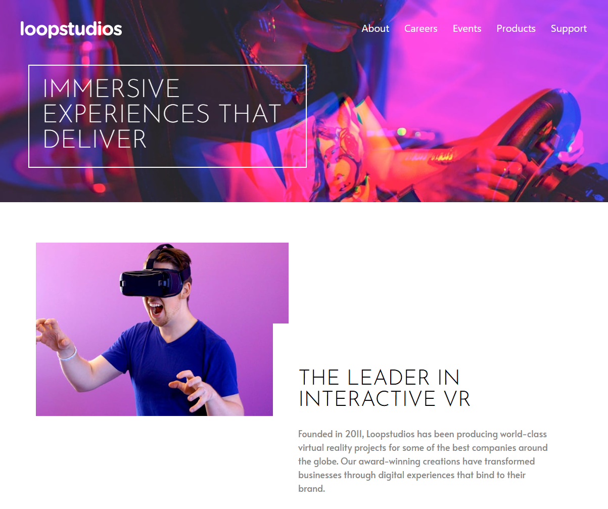

# Frontend Mentor - Loopstudios landing page solution

This is a solution to the [Loopstudios landing page challenge on Frontend Mentor](https://www.frontendmentor.io/challenges/loopstudios-landing-page-N88J5Onjw). Frontend Mentor challenges help you improve your coding skills by building realistic projects.

## Table of contents

- [Overview](#overview)
  - [The challenge](#the-challenge)
  - [Screenshot](#screenshot)
  - [Links](#links)
- [My process](#my-process)
  - [Built with](#built-with)
  - [What I learned](#what-i-learned)
  - [Continued development](#continued-development)
  - [Useful resources](#useful-resources)
  - [AI Collaboration](#ai-collaboration)
- [Author](#author)
- [Acknowledgments](#acknowledgments)

**Note: Delete this note and update the table of contents based on what sections you keep.**

## Overview

### The challenge

Users should be able to:

- View the optimal layout for the site depending on their device's screen size
- See hover states for all interactive elements on the page

### Screenshot

### Links

- Solution URL: [Add solution URL here](https://github.com/denissoboslai13/frontend-mentor-loopstudios-page)
- Live Site URL: [Add live site URL here](https://denissoboslai13.github.io/frontend-mentor-loopstudios-page/)

## My process

### Built with

- Semantic HTML5 markup
- CSS custom properties
- Flexbox
- CSS Grid
- Mobile-first workflow
- [React](https://reactjs.org/)
- [Tailwind](https://tailwindcss.com/)
- [Motion](https://motion.dev/)

### What I learned

Im gonna be completely honest, i did this challenge about a month ago, just didnt submit it until now, looking back at it i guess the bit with the our creations little cards is cool, but aside from that not much sticks out.

## Author

- Frontend Mentor - [@denissoboslai13](https://www.frontendmentor.io/profile/denissoboslai13)
